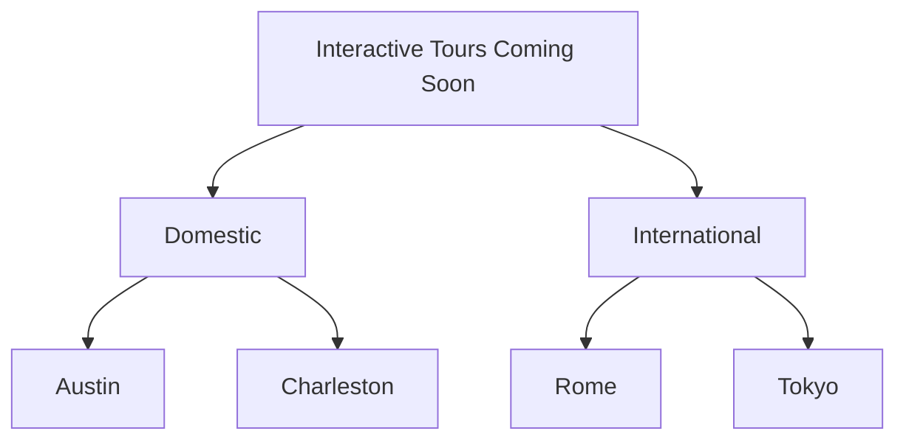

<Callout icon="✨" theme="default">
  ### Play Around with Pre-Built Components

  This page is fully editable for you and your team! Try inserting pre-built components and adding content and Markdown styling, or edit the once below to get a feel for how to use them.
</Callout>

In the ReadMe Editor UI, you can easily add MDX components using slash commands:

1. Type `/` in the editor to open the command menu
2. Look for the "Component" section in the menu
3. Select the component you want to use:
   * `/tabs` - Create tabbed content
   * `/accordion` - Add expandable sections
   * `/cards` - Create a card grid layout
   * `/columns` - Add vertical columns of text
   * `/mermaid diagram` - Create diagrams and charts with Mermaid.js

<Image align="center" src="https://files.readme.io/d8744698615616d821a6fd57fdbf1bc8870e66779f014d88745cd5f9ab6cc9db-CleanShot_2025-06-09_at_15.56.14.gif" />

The component will be inserted with a default structure that you can customize with your content. You can also add the base component to your Custom Components page in either your child project or Enterprise Group and customize further!

## MDX Syntax Basics

### Components

MDX allows you to use components directly in your Markdown:

```markdown
# Regular Markdown Heading

<MyComponent>
  This is inside a component
</MyComponent>

Back to regular Markdown
```

### JavaScript Expressions

Use JavaScript expressions within curly braces:

```javascript
# {frontmatter.title}

The current date is {new Date().toDateString()}
```

### Mixing HTML, JSX, and Markdown

Freely combine different syntax types:

```mdx Example
# Welcome

<div style={{ padding: '20px', backgroundColor: 'lightgrey' }}>
  This is a **Markdown** paragraph inside a <div>.
</div>
```

## Implementation

### Organizing Related Content

**Example**

When you have multiple related topics or examples, use Tabs:

<Tabs>
  <Tab title="Configuration">
    First, set up your configuration...
  </Tab>

  <Tab title="Usage">
    Now you can use the feature...
  </Tab>

  <Tab title="Examples">
    Here are some examples...
  </Tab>
</Tabs>

***

### Progressive Disclosure

Use Accordions for optional or detailed information:

**Example: API Rate Limits**

Our API has a default rate limit of 100 requests per minute.

<Accordion title="Understanding Rate Limit Headers" icon="fa-info-circle">
  Each API response includes these rate limit headers: `X-RateLimit-Limit`: Total requests allowed or `X-RateLimit-Remaining`: Requests remaining
</Accordion>

***

### Feature Showcases

Present features or options using Cards:

**Example**

<Cards columns={4}>
  <Card title="Authentication" icon="fa-lock" href="/authentication">
    **Secure your API**
    Learn about authentication methods and security
  </Card>

  <Card title="Endpoints" icon="fa-code" href="/endpoints">
    *Explore our API*
    Comprehensive endpoint documentation
  </Card>

  <Card title="SDKs" icon="fa-box" href="/sdks">
    > Find client libraries
    > Available in multiple languages
  </Card>

  <Card title="Guides" icon="fa-book" href="/guides">
    Step-by-step tutorials and examples
  </Card>
</Cards>

***

### Improved Readability and Scanability

Present content in a more digestible way using Columns:

**Example**

<Columns layout="auto">
  <Column>
    Columns break content into narrower chunks.
  </Column>

  <Column>
    *They help reader scan for key information quickly.*
  </Column>

  <Column>
    > Columns can also help present related items side-by-side, making relationships or differences immediately apparent.
  </Column>
</Columns>

***

### Guide Users Through Step-by-Step Decisions

Help readers navigate paths based on specific criteria or situations using Mermaid.js Diagrams:

**Example**


